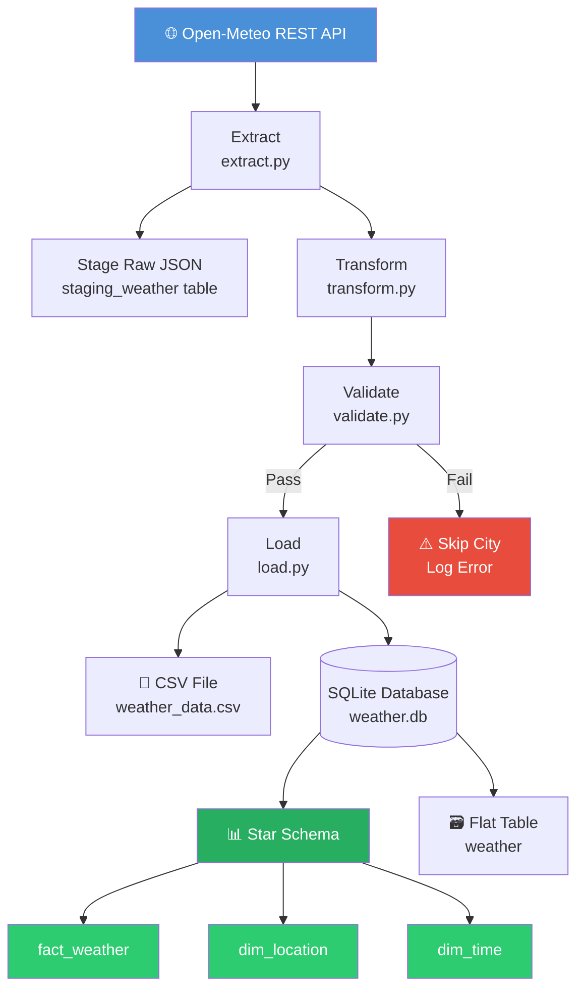

# Weather Data Pipeline

A production-style Python ETL/ELT pipeline that pulls 3-day hourly weather forecasts for Lagos, Abuja, and Kano from the Open-Meteo REST API, transforms the data into a structured format, and loads it into a SQLite star schema with staging, validation, and structured logging.

## What it does

- Fetches hourly temperature, precipitation, and wind speed data for Lagos, Abuja, and Kano from the Open-Meteo public REST API
- Stages raw JSON responses into a SQLite staging table before transformation (ELT pattern)
- Parses and flattens nested JSON into a pandas DataFrame, converts timestamps to datetime objects
- Validates data quality — null checks, row count verification, and temperature range checks
- Loads cleaned data into a SQLite star schema (fact_weather, dim_location, dim_time) and CSV
- Handles API failures per city gracefully without crashing the pipeline
- Logs all pipeline events and errors to both terminal and pipeline.log

## Architecture



## Tech stack

- Python 3
- pandas
- requests
- sqlite3 (built-in)
- logging (built-in)
- pytest

## How to run it

1. Clone the repository
```
git clone https://github.com/Funmisho/weather-pipeline.git
cd weather-pipeline
```

2. Create and activate a virtual environment
```
python3 -m venv venv
source venv/bin/activate
```

3. Install dependencies
```
pip install -r requirements.txt
```

4. Run the pipeline
```
python3 pipeline.py
```

5. Run the tests
```
python3 -m pytest tests/ -v
```

## Project structure

```
weather-pipeline/
├── pipeline/
│   ├── config.py       # API base URL, city coordinates, and parameters
│   ├── extract.py      # Fetches raw JSON data from the Open-Meteo API
│   ├── transform.py    # Parses JSON, builds DataFrame, formats timestamps
│   ├── load.py         # Saves data to CSV, flat SQLite table, and star schema
│   └── validate.py     # Data quality checks before loading
├── tests/
│   └── test_pipeline.py  # pytest unit tests
├── pipeline.py         # Orchestrates the full ETL/ELT pipeline
├── schema.sql          # Star schema table definitions
├── requirements.txt
└── data/               # Output folder (generated on run, gitignored)
```

## Star schema design

```
dim_location          dim_time                 fact_weather
------------          --------                 ------------
location_id (PK)      time_id (PK)             weather_id (PK)
city                  timestamp                location_id (FK)
latitude              date                     time_id (FK)
longitude             hour                     temperature_2m
                      day_of_week              precipitation
                      month                    windspeed_10m
                      year
```

## Sample output

| time                | temperature_2m | precipitation | windspeed_10m | city  |
|---------------------|----------------|---------------|---------------|-------|
| 2026-07-04 00:00:00 | 25.9           | 0.1           | 8.9           | lagos |
| 2026-07-04 01:00:00 | 25.6           | 0.3           | 5.1           | lagos |
| 2026-07-04 02:00:00 | 25.2           | 0.2           | 4.4           | lagos |
| 2026-07-04 03:00:00 | 25.0           | 0.2           | 3.8           | lagos |
| 2026-07-04 04:00:00 | 25.1           | 0.2           | 3.1           | lagos |